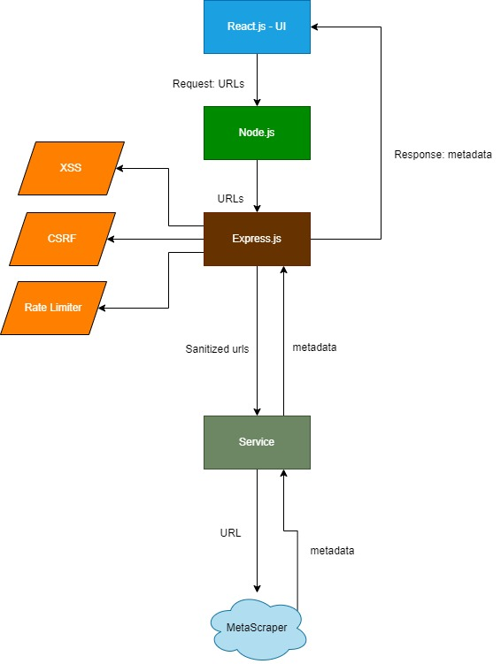

# URL Fetch

## System Diagram


## Technologies Used

- **Backend**: Node.js, Express.js

- **Frontend**: React.js

- **Testing**: jest, chai, mocha

## Running the Project
### Prerequisites

- Node.js and npm

### Steps to Run

1. Clone the repository
```Bash []
git clone https://github.com/HaythamT95/URL_Fetch.git
```

2. Start the Back-End
```Bash []
cd back-end
npm install
set .env environment variable PORT=<choose_port>, and SESSION_SECRET=<your_secret>
npm start
```

3. Start the Front-End
```Bash []
cd front-end
npm install
npm start
```

4. Testing the application
- **Backend**
```Bash []
cd back-end
npm start
```
open another terminal
```Bash []
cd back-end
npm test
npm test-rate
npm test-csrf
```

- **Frontend**
```Bash []
cd front-end
npx jest
```
